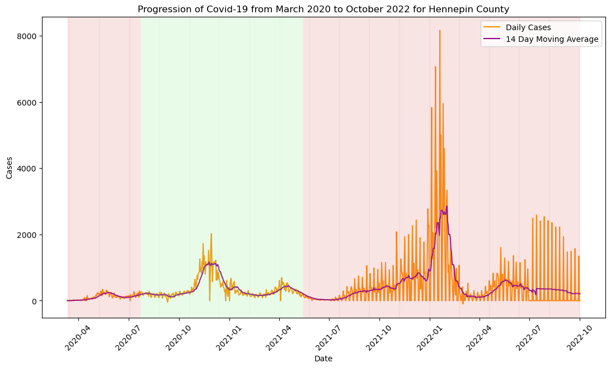
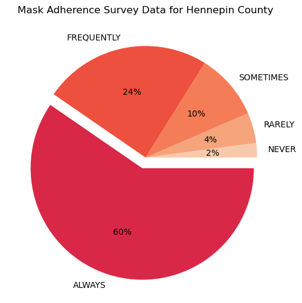

# Visualization Explanantion

- The below visualization represents the mask policy in effect for Hennepin County where red represents "No" if Face masks are not required in public and green represents "Yes" if masks are required in the public. There are only two change points for the county I am analyzing.

- The following visualization shows the progression of covid-19. The daily cases and the 14 day moving average for Hennepin County, Minnesota are described in the below visualization along with the mask policy in effect.

- In the above visualization we can see that there is a spike in cases after the mask policy was in place, though this might seem counterintuitive, it makes sense that mask policies would follow after there is a potential forecast for a spike in cases. 
- We see sharp spikes even in the 14 day moving average and this could be due to a massive lag in reporting cases around holidays. For Example, we see a dip in cases before the 2022 new year followed by a spike, indicating that there was a change in the rate of covid case reporting.
- We see that after the mask policy is rescinded, we see a dip in cases for a few weeks before they start rising again, which could be a consequence of the mandated policy. 
- There is an unexplained dip in the number of cases in March of 2022, this could be due to vaccinations and having access to that data could have helped improve our understanding of the progression of covid-19
-The below visualization represents the change in slope of the 14 day moving average, to understand how the rate of covid-19 transmission changed. I have also encoded the masking policy changes in the below visualization.

- This visualization better indicates the sudden changes in the number of cases in the given time period, There is a massive dip in February of 2022, [This](https://www.kff.org/coronavirus-covid-19/poll-finding/kff-covid-19-vaccine-monitor-february-2022/) study indicates that 73% of the US Adult population were vaccinated by Februrary of 2022, this could be the possible reason behind the decrease in rate of transmission.
- I realized that instead of expecting a decrease in cases when mask policy is in effect, the mask ppolicy is mandated only when there is projection of spike in the cases and removed when the authorities believe there is less risk of transmission, so rather than decrease of cases following mask mandates, we witness that mask policy follows the trend in cases wherein, when there is an increase in case there are higher chances of a mask policy being in effect.
- The below graph represents the proportion of population in Hennepin COunty, Minnesota that follow varying degrees of mask coverage in public when people are less than 6 feet away from them. We see that 60% of the population always wears a mask, [This Report](https://www.cdc.gov/mmwr/volumes/71/wr/mm7106e1.htm) says that there is decrease in the transmission of covid by over 50% when masks are used by everyone. 

- Because there was not a high adherence to the mask policy, We see that the covid-19 was not controlled as expected by the spike present  in the green band, and following the removal of the mask mandate, we can expect that fewer people wore masks causing the increase in cases even though vaccinations had begun in late 2021 and early 2020.
